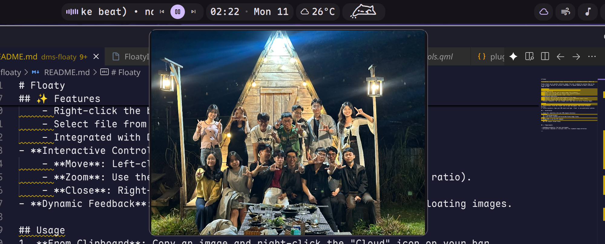

# Floaty

Pin reference images, screenshots, and PDFs on top of your workspace.



## Install


**Required:** This plugin requires [dms-common](https://github.com/hthienloc/dms-common) to be installed.

```bash
# 1. Install shared components
git clone https://github.com/hthienloc/dms-common ~/.config/DankMaterialShell/plugins/dms-common

# 2. Install this plugin
dms://plugin/install/floaty
```

Or manually:
```bash
git clone https://github.com/hthienloc/dms-floaty ~/.config/DankMaterialShell/plugins/floaty
```

## Features

- **Float from anywhere** - Clipboard, file picker, drag & drop, or URL
- **Multi-format support** - PNG, JPG, WebP, BMP, SVG, PDF (page selection)
- **Smart layout** - Auto-tiling prevents overlapping
- **Always on top** - Windows stay visible while you work
- **IPC ready** - Script-friendly commands for automation

## Usage

| Action | Result |
|--------|--------|
| Drag onto icon | Quick float |
| Left click | Open menu |
| Right click | Paste from clipboard |
| Scroll | Resize image |
| Middle click | Close |

## IPC Commands

```bash
# Float from clipboard
dms ipc call floaty floatFromClipboard

# Open file selector
dms ipc call floaty selectFileAndFloat

# Close all windows
dms ipc call floaty closeAllWindows

# Toggle minimize/expand all
dms ipc call floaty toggleMinimizeAll
dms ipc call floaty minimizeAll
dms ipc call floaty expandAll

# Float from URL or path
dms ipc call floaty floatFromUrl "file:///path/to/image.png"
```

### Example: Screenshot to Floaty

Bind to your window manager (e.g., Niri):

```kdl
bindings {
    Print { spawn "sh" "-c" "dms screenshot region --no-file --no-notify && dms ipc call floaty floatFromClipboard"; }
}
```

## Requirements

- `poppler-utils` - PDF conversion (`pdftocairo`, `pdfinfo`)

## License

MIT
